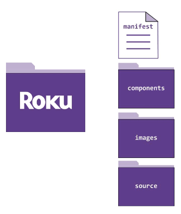
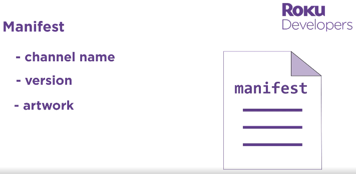
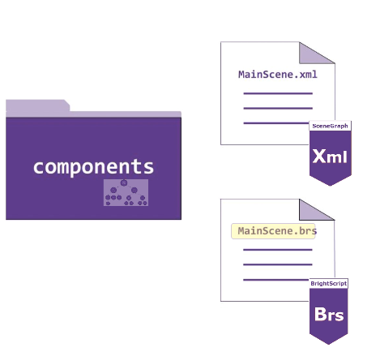
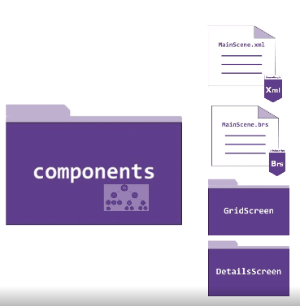
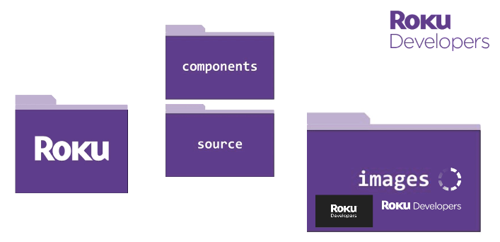
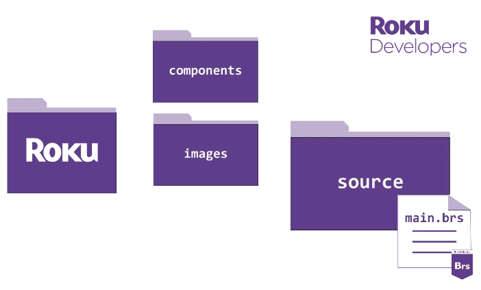
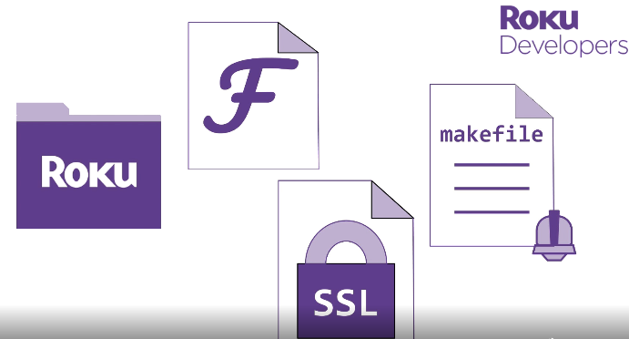
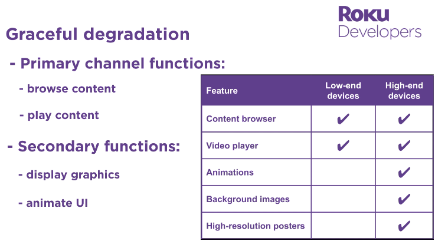

## Debug console

- Use telnel if is supported on like unix os with cmd: ```telnet {roku_device_ip} 8085``` 

```sh
# example:
00:00 ᴢᴇʀᴏ:/~ telnet 192.168.1.84 8085
```

## BrightScript & SceneGraph reference

- [developer.roku.com/es-mx/docs/references](https://developer.roku.com/es-mx/docs/references/references-overview.md)

<h2 align="center">Source Code Directory Structure:</h2>
<p align="center"></p>
<p align="center"></p>
<p align="center"></p>
<p align="center"></p>
<p align="center"></p>
<p align="center"></p>
<p align="center"></p>
<p align="center"></p>


<h2 align="center">Features by device degradation:</h2>
<p align="center"></p>


## Display multimedia content

- Use Content Feed with Nodes [developer.roku.com/es-mx/videos/courses/rsg/content-feed](https://developer.roku.com/es-mx/videos/courses/rsg/content-feed.md) - with video from CND (Content Delivery Network) or OVP (Online Video Platform) on [feed.json](./src_feed_samples/roku-developers-feed-v1.json) format sample

- Follow Direct Publisher Feed format specifications [developer.roku.com/es-mx/docs/specs/direct-publisher-feed-specs/feed-spec](https://developer.roku.com/es-mx/docs/specs/direct-publisher-feed-specs/feed-spec.md)