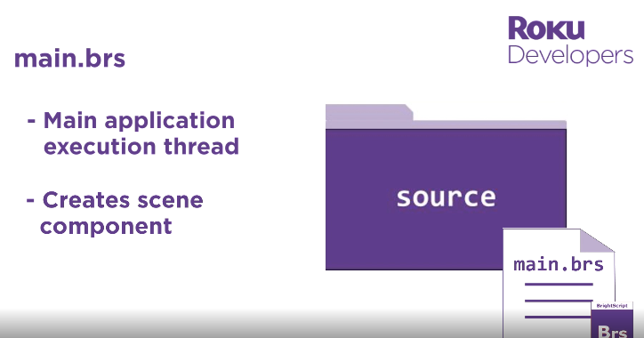

## Debug console

- Use telnel if is supported on like unix os with cmd: ```telnet {roku_device_ip} 8085``` 

```sh
# example:
00:00 ᴢᴇʀᴏ:/~ telnet 192.168.1.84 8085
```

## BrightScript & SceneGraph reference

- [developer.roku.com/es-mx/docs/references](https://developer.roku.com/es-mx/docs/references/references-overview.md)

<h2 align="center">Source Code Directory Structure:</h2>
<p align="center"></p>
<p align="center"></p>
<p align="center"></p>
<p align="center"></p>
<p align="center"></p>
<p align="center"></p>
<p align="center"></p>
<p align="center"></p>


<h2 align="center">Features by device degradation:</h2>
<p align="center"></p>